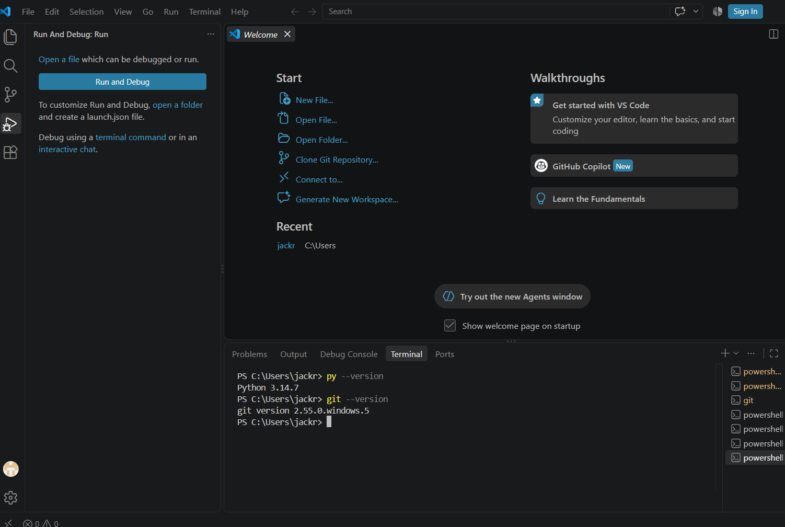

# is310-coding-assignments

## Proof of Installation

1. Python

2. Git

3. VS Code

hypothesis username - jgoby2

5.
I plan to use the copilot chat through VS code for any aid I might need during this course.
